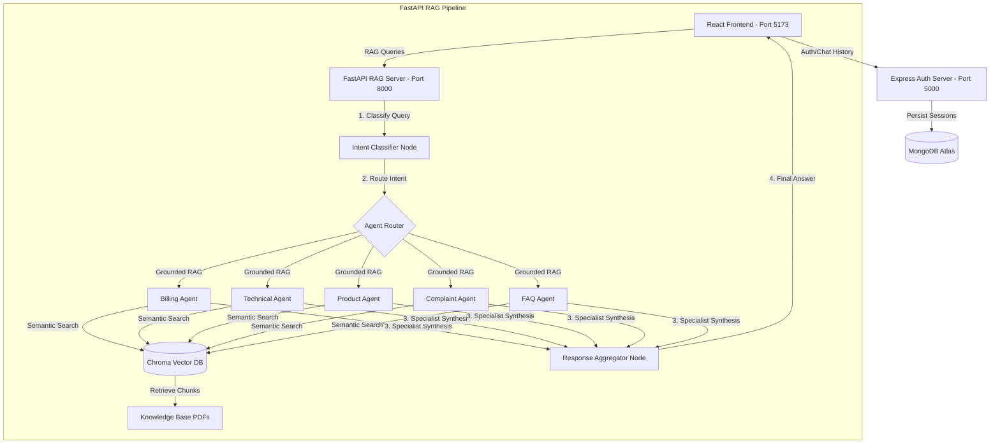

# Multi-Agent AI Customer Support Assistant using RAG & LLMs

An industry-level capstone customer support system. This application implements a hybrid backend architecture combining a **Node.js Express** server (for user authentication, chat session management, and feedback analytics) and a **Python FastAPI** server running a compiled **LangGraph multi-agent RAG workflow**.

---

## 1. System Architecture



---

## 2. Key Features

- **Intelligent Intent Detection**: Incoming customer queries are classified by a central LLM router into one or more intents.
- **Parallel Routing & Fan-In (LangGraph)**: Multi-domain queries (e.g. *"I paid yesterday but my account login is still locked"*) execute multiple specialist nodes in parallel. The Aggregator node resolves overlaps and aggregates answers into a single, cohesive message.
- **Retrieval-Augmented Generation (RAG)**: Uses `all-MiniLM-L6-v2` HuggingFace Embeddings and ChromaDB for semantic search across domain-specific knowledge folders.
- **JWT-Protected User Authentication**: Sign-up, Sign-in, and session persistence powered by Express and MongoDB.
- **Persistent Chat History**: Previous chats and message histories are saved to MongoDB, allowing users to return to previous conversations.
- **CSAT Response Feedback**: Users can submit thumbs up/down feedback on AI answers, which updates MongoDB live.
- **Live Analytics Dashboard**: Highlights key performance metrics including average response time, CSAT score, total message count, and a visual bar graph showing agent usage distribution.

---

## 3. Project Directory Structure

```
customer-support-ai/
├── frontend/                     # React (Vite) App
│   ├── src/
│   │   ├── components/           # Navbar, Shared components
│   │   ├── context/              # AuthContext
│   │   ├── pages/                # Home, Login, Register, Dashboard, Chat, Analytics
│   │   ├── App.jsx               # Routes & layout mapping
│   │   └── index.css             # Tailwind imports & brand variables
│   └── vite.config.js            # Dual API proxies (/api, /rag)
│
├── server/                       # Express Session Server
│   ├── config/                   # MongoDB connection config
│   ├── controllers/              # Auth & Chat controller logic
│   ├── shemas/                   # User & Chat Mongoose schemas
│   ├── routers/                  # Express routes definitions
│   └── index.js                  # Entry point
│
├── Rag/                          # RAG FastAPI Engine
│   ├── knowledge_base_1/         # Billing PDFs
│   ├── knowledge_base_2/         # Technical Support PDFs
│   ├── knowledge_base_3/         # Product specs PDFs
│   ├── knowledge_base_4/         # Grievance / Complaint PDFs
│   ├── knowledge_base_5/         # General FAQ PDFs
│   ├── api.py                    # FastAPI server (Lazy-loads LangGraph)
│   ├── graph.py                  # LangGraph workflow structure
│   ├── ingest.py                 # VectorDB document chunker & indexer
│   ├── nodes.py                  # Node logic, Prompts, & RAG Retrieval
│   └── state.py                  # LangGraph TypedDict state & Reducer
│
└── sample_questions.pdf          # 5 Grounded & 5 Out-of-Scope test questions per agent
```

---

## 4. Setup & Installation

### Step 1: Clone and Configure environments

Create the following `.env` configuration files:

#### 1. Express Server Env (`server/.env`)

```env
MONGO_URI=your_mongodb_connection_string
PORT=5000
JWT_KEY=your_jwt_signing_key
```

#### 2. RAG Backend Env (`Rag/.env`)

```env
GOOGLE_API_KEY=your_google_gemini_api_key
LLM_MODEL_NAME=gemma-4-31b-it # (Optional) Default model to run (e.g., gemini-2.0-flash, gemma-4-31b-it)
```

---

### Step 2: Ingest Knowledge Base Documents

Before starting the servers, you must run document chunking to populate the local vector store:

```bash
cd Rag
# Install Python packages
pip install fastapi uvicorn langchain langchain-community langchain-google-genai langchain-huggingface langchain-chroma pypdf reportlab python-dotenv

# Ingest and embed files into ChromaDB
python ingest.py
```

---

### Step 3: Run the Servers

You will need three terminal tabs to run the full application:

#### Tab A: Express Auth & History Server

```bash
cd server
npm install
node index.js
```

*Server runs at http://localhost:5000*

#### Tab B: FastAPI RAG Engine

```bash
cd Rag
python api.py
```

*FastAPI runs at http://localhost:8000*

#### Tab C: Vite React Frontend

```bash
cd frontend
npm install
npm run dev
```

*Vite web client serves at http://localhost:5173*

---

## 5. System Testing

We have compiled a complete testing suite in [sample_questions.pdf](sample_questions.pdf). Open this PDF to find:

- **5 Grounded Queries per Agent**: Test inputs that have matching documentation (e.g. *"What is the physical address of the Acme Corporation head office?"*).
- **5 Out-of-Scope Queries per Agent**: Test inputs designed to check the model's grounding capability (e.g. *"Can I order a custom engraved product from your store?"*).
- **Parallel Queries**: Multi-domain entries that route to multiple agents simultaneously.
